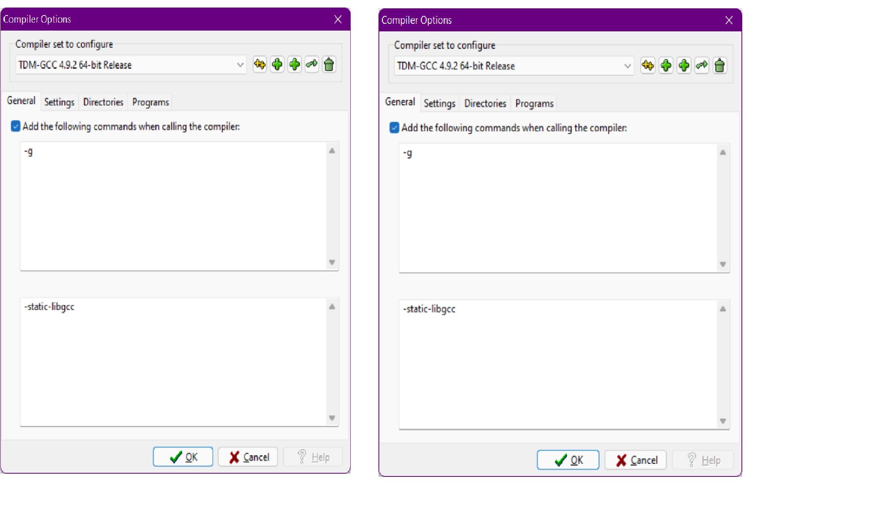

# ProblemSolvingUsingCPP

This is the repo, where I learn C++ and use it to understand various algorithms. Goal is to be prepared for interview question related to problem solving.

## IDE Download and configuration

- Downloaded the IDE from [here](https://sourceforge.net/projects/orwelldevcpp/)
- Configuration of IDE was done using [this](https://www.softwaretestinghelp.com/dev-cpp-ide/)
  - You might also want to look at the below"
    > 
- Created .gitignore using [this](https://www.toptal.com/developers/gitignore)
- Online compiler can found [here](https://www.onlinegdb.com/online_c++_compiler)
